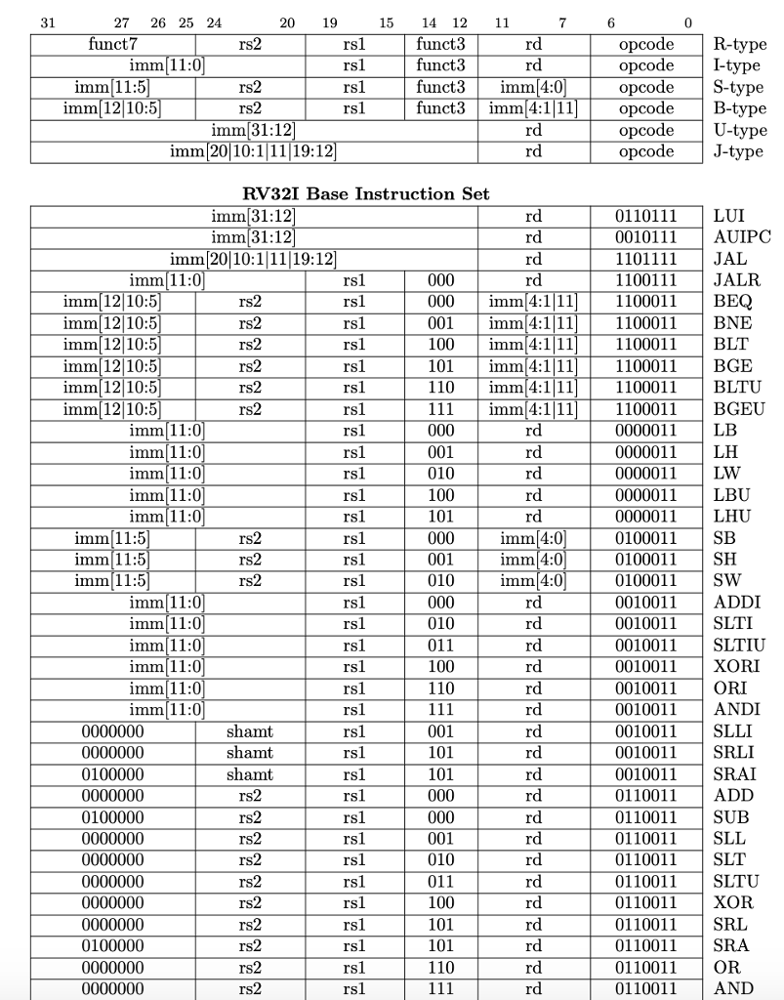
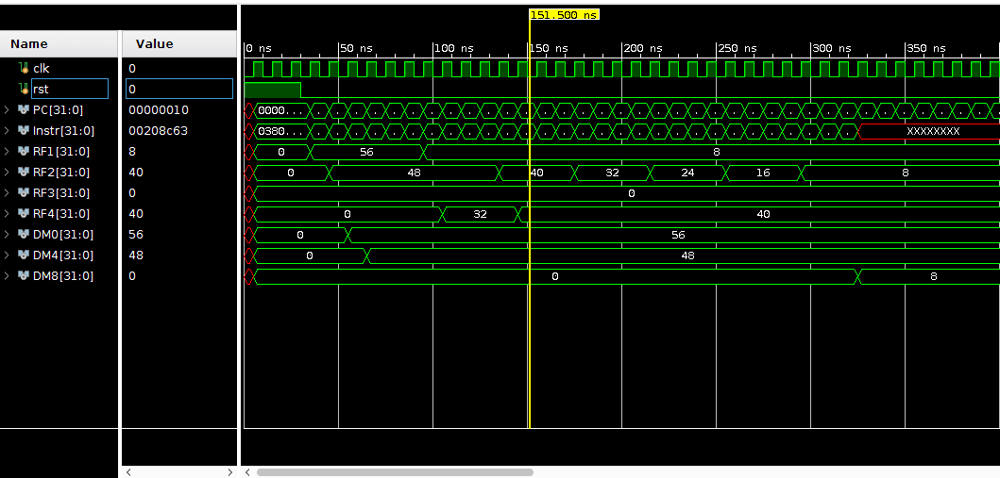

# Single Cycle RV32I
This is the readme file to demonstrate the 32-bit Single Cycle RISC-V processor with all the base instructions.

## Design
The following datapath and controller design is implemented in verilog, simulated in VIVADO design suit 2018 and synthesize for the Nexys-A7 FPGA board.

## Instruction Set Architecture
RISC-V 32-bit Integer type ISA is implemented as part of the single cycle processor. It includes the following type of instruction;
* R-type
* I-type 
* U-type
* B-type
* Load and Store type with word, half word and byte memory access.
* J-type

The list of all the instructions implemented in this project are listed below;

For more information regarding RV32I ISA and the working of its each instruction, refer to this [page](https://msyksphinz-self.github.io/riscv-isadoc/html/rvi.html#).

## Documentation
This project contains three main directories;
#### 1. Design_Sources
In this directory, the following verilog modules are present;
* ALU.v
* Branch.v
* ControlUnit.v
* Data_Memory.v
* DecodeUnit.v
* extend.v
* Instruction_Memory.v
* register_file.v
* top_level.v
* code.mem

Here, code.mem is the memroy file which contains the machine code for the program that will be executed on the processor. **code.mem** is initialized with the machine code that will calculate the GCD of two numbers. Also, **top_level.v** is the main module in which all the remaining modules are being called and concatenated to complete the whole datapath.

#### 2. Test_Benches
In this directory, the testbenches of every main design source is present along with the testbench of top module which is named as **toplevel_TB.v**. 

#### 3. Assembler_Resources
This directory contains the resources for assembling the RISC-V assembly program to generate the machine code and dump that machine code into code.mem. The RISC-V assembly code and its corresponding machine code is obtained using **venus simulator** and saved in the file named "assembly". Then python text parsing is used to extract the machine code and dump it into the **code.mem** file.

## DEMO
* **Step 1**: Create a Vivado project.
* **Step 2**: Import all the files as design source file present in Design_Sources directory.
* **Step 3**: Import toplevel_TB.v file from Test_Benches directory as simulation source file.
* **Step 1**: Run the simulation and observe the registers of Data Memory and Register File which are declared as output of the toplevel.v module.

Note: By default, the machine code of GCD is dumped into the code.mem file. If you want to change the program using the venus simulator extention in VScode, then change the line number 2 and 3 and set path according to your local directories. Otherwise, simply dump the machine of your choice in code.mem file and simulate.

## Simulation
The assembly program of GCD is given in **assem.s** file inside the Assembler_Resources directory. It uses the x1 and x2 registers of Regiter File and first two registers of Data Memory for the numbers whose GCD is being calculated. And the result is stored in the third register (at memory location of 8) inside the Data Memory. 
The simulated results are shown as follows;
